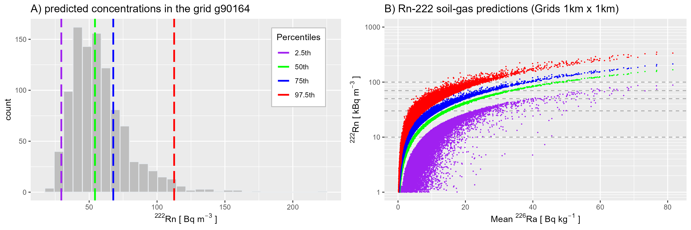
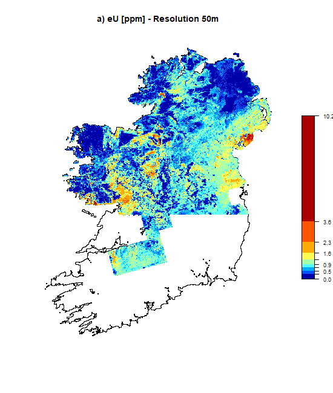
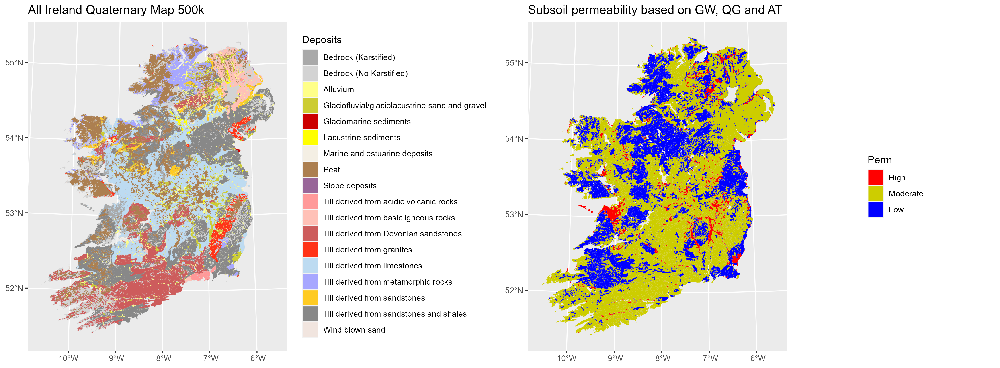
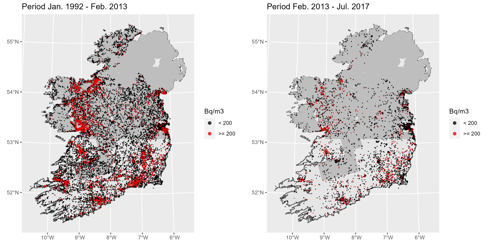
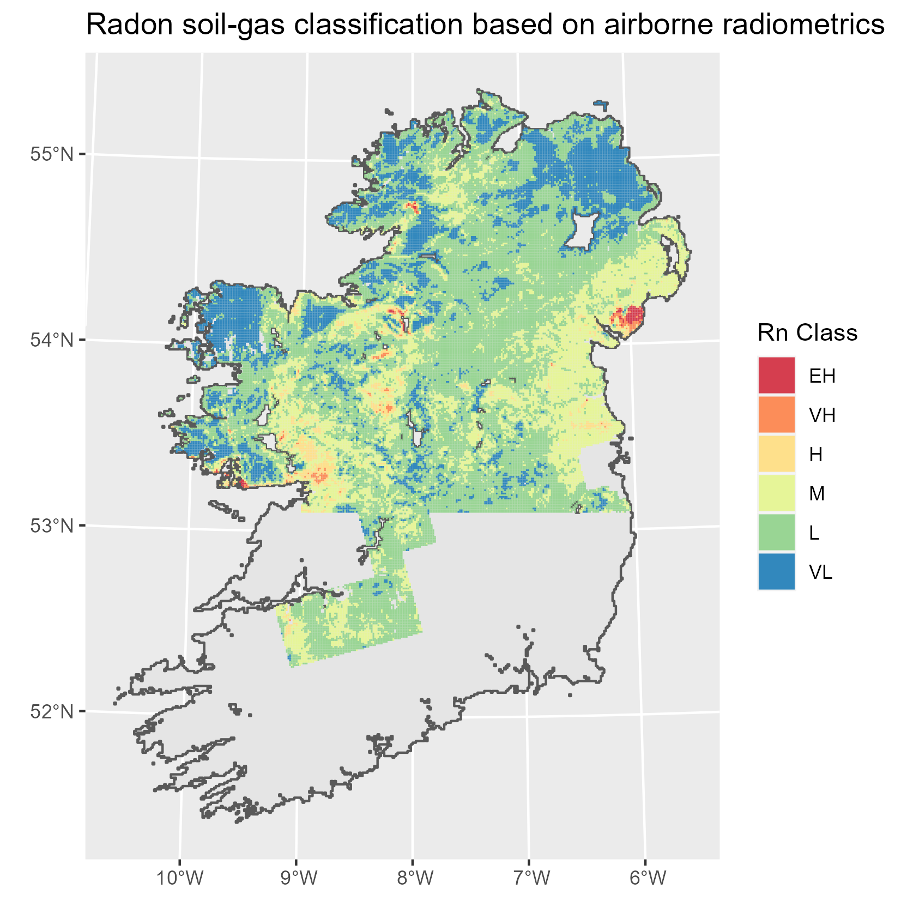
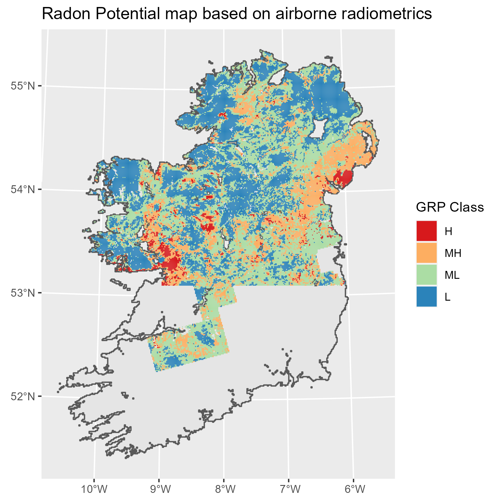
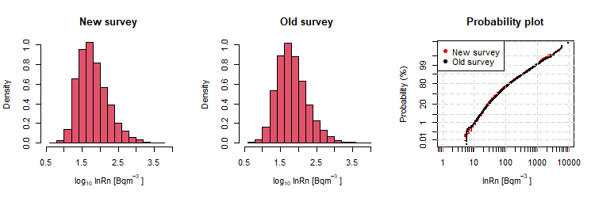
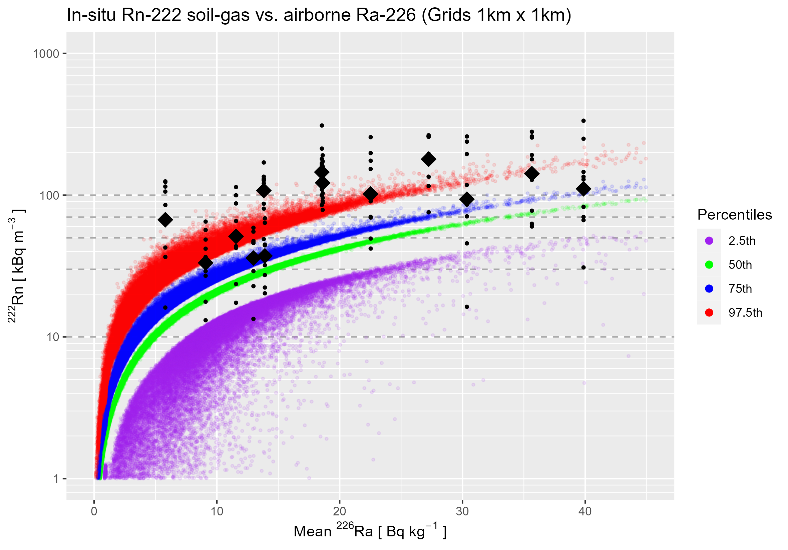
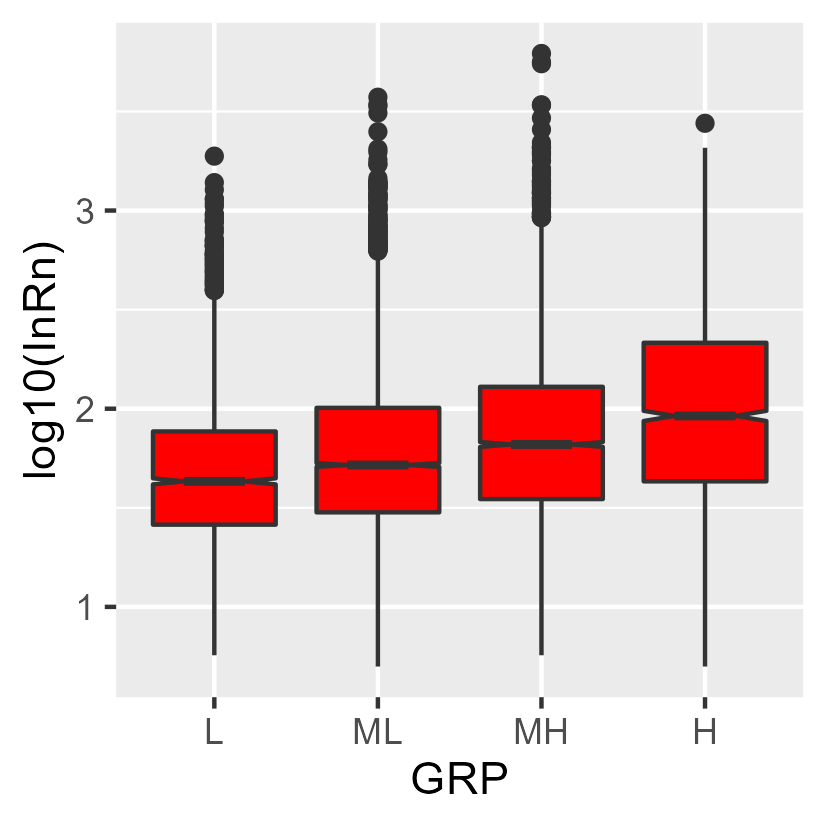

```{r setup, include=FALSE}
  knitr::opts_chunk$set(include = TRUE,
                        echo = TRUE,
                        results = "hide",
                        fig.pos = "H",
                        fig.align = "center",
                        warning = FALSE,
                        message = FALSE)

  library(tidyverse)
  library(sf)
  library(stars)
  library(parallel)

```

# Data

## Ireland (RoI and NI)
Read grid cells of 1km x 1 km (same grid cells where Ireland has population data just in case we would need to link the RP radon map with population density).
```{r Ireland}

  Grids1km <- read_sf("Rdata/Grids1km/IR_NI_Grids_1km.shp")
    
  Ireland <- Grids1km %>%
    group_by(Id) %>%
    summarise(N = n()) %>%
    ungroup()

```

## Airborne (eU)
We have aggregated the initial data (with a resolution of 50 x 50 m; i.e. *Tellus radiometric merged grd, tiff and gxf (981.9 MB)* - [Tellus](https://www.gsi.ie/en-ie/data-and-maps/Pages/Geophysics.aspx)) in grid cells of 1x1 km (after running a separate script, i.e. *Average_eU_grid_cells_1km2*). Here we read directly the aggregated map (*eU_Grids1km*), and we use the initial map (*eU_50m*) only for comparison (Figure 3).
```{r eU, results = 'asis'}

  eU<-"Rdata/Radiometrics/RAD_MERGED_GRIDS/GXF/Tellus_RAD_eU_MERGE_2019.gxf"
  eU_50m  <- read_stars(eU) %>% st_set_crs(st_crs(Grids1km)) 
     
  eU_Grids1km <- read_sf("Rresults/eU_Grids1km.shp")

  eU_50m_tbl <- eU_50m %>% 
  #as.tbl_cube() %>%
  as.data.frame() %>%
  drop_na()  
  
  cbind(tibble(Resolution = c("50 m","1 km")),
        rbind(summary(eU_50m_tbl$Tellus_RAD_eU_MERGE_2019.gxf),
              summary(eU_Grids1km$eU_AM)
        )
  ) %>%
    mutate_if(is.numeric, ~round(., 2)) %>%
    knitr::kable(format = "latex", booktabs=TRUE) %>%
    kableExtra::kable_styling(position = "center")
  
```

## Radium predictions (Ra-226)
  + Radium (Ra-226) activity in Bq/kg 
  + Equilibrium with eU (1 ppm eU = 12.35 Bq/kg)
```{r Grids1km_area}

  eU_Grids1km <- eU_Grids1km %>%
    mutate(AM_Ra226 = 12.35*eU_AM,
           SD_Ra226 = 12.35*eU_SD) 

```

```{r Plot_eRa}
  
  ggplot() +
    geom_sf(data = Ireland) +
    geom_sf(data = eU_Grids1km, aes(fill = AM_Ra226), colour = NA) +
    scale_fill_gradient2(
    name = expression(""^226*Ra * " [ " * "Bq "* kg^-1 * " ]"),
    midpoint = 30, 
    low   = "#0000AA",
    mid   = "#AAFFAA",
    high  = "#AA0000") +
    ggtitle("Airborne radiometrics (Grids 1km x 1km)") 
    
```

## All-Ireland Quaternary map (scale 1:500.000)
```{r Quaternary, cache.extra = file.info("Rdata/GSI_Quaternary_500k/QG_500k.shp")}

  QG <- read_sf("Rdata/GSI_Quaternary_500k/QG_500k.shp") %>% 
    mutate(Sediment_5 = as_factor(Sediment_5)) %>%
    group_by(Sediment_5) %>%
    summarise(N = n(),
              area_sq_km = sum(area_sq_km),
              label = first(label)) %>%
    ungroup()
   
```

## Aquifer Type

```{r Aquifer, cache.extra = file.info("Rdata/Groundwater/IRL_AQUIFER_BEDROCK_ITM.shp")}

AQ <- read_sf("Rdata/Groundwater/IRL_AQUIFER_BEDROCK_ITM.shp") %>%
    rmapshaper::ms_simplify(keep = 0.01, keep_shapes = TRUE) %>%
    st_make_valid()
  
  Karst <- AQ %>% 
    group_by(AQUIFERCAT) %>%
    summarize(AQUIFER_DE = first(AQUIFER_DE)) %>%
    ungroup() %>%
    filter(AQUIFERCAT != "Lake" & AQUIFERCAT != "Unclas") %>%
    mutate(Karst = case_when(
      AQUIFERCAT == "Lk"     ~ "TRUE",
      AQUIFERCAT == "LkNI"   ~ "TRUE",
      AQUIFERCAT == "Ll"     ~ "FALSE",                         
      AQUIFERCAT == "LlNI"   ~ "FALSE",                 
      AQUIFERCAT == "Lm"     ~ "FALSE",                
      AQUIFERCAT == "LmNI"   ~ "FALSE",              
      AQUIFERCAT == "NI_Un*" ~ "FALSE",                  
      AQUIFERCAT == "PINIl"  ~ "FALSE",       
      AQUIFERCAT == "Pl"     ~ "FALSE",      
      AQUIFERCAT == "PlNI"   ~ "FALSE",     
      AQUIFERCAT == "Pu"     ~ "FALSE",    
      AQUIFERCAT == "PuNI"   ~ "FALSE",   
      AQUIFERCAT == "Rf"     ~ "FALSE",  
      AQUIFERCAT == "Rf/Rk"  ~ "TRUE" , 
      AQUIFERCAT == "RfNI"   ~ "FALSE",
      AQUIFERCAT == "Rk"     ~ "TRUE",
      AQUIFERCAT == "Rkc"    ~ "TRUE",
      AQUIFERCAT == "RkcNI"  ~ "TRUE",
      AQUIFERCAT == "Rkd"    ~ "TRUE",
      AQUIFERCAT == "RkNI"   ~ "TRUE",
      TRUE ~ as.character(AQUIFERCAT))
    ) %>%
    group_by(Karst) %>%
    summarise(N = n()) %>%
    ungroup()

```

## Subsoil permeability 

Load *SP_GW_naQG.shp* file; output of the R-script: *SP_Groundwater_recharge.R*.
```{r}

  SP <- read_sf("Rresults/Soil_Permeability/SP_GW_naQG.shp") %>%
    rename(Perm = PERM) %>%
    mutate(Perm = factor(Perm,
                         levels = c("H", "M", "L"),
                         ordered = TRUE)) 
  
```


Rasterize: convert Subsoil Permeability shapefile (SP) to a raster file with a resolution of 1km x 1 km).

  a) Make grids equal to the cell grids of eU data (1km x 1km)

```{r}

  grd_res_x <- 1000 # m
  grd_res_y <- 1000 # m
  grd <- st_as_stars(st_bbox(eU_Grids1km),
     nx = (st_bbox(eU_Grids1km)[3] - st_bbox(eU_Grids1km)[1]) / grd_res_x,
     ny = (st_bbox(eU_Grids1km)[4] - st_bbox(eU_Grids1km)[2]) / grd_res_y,
     xlim = c(st_bbox(eU_Grids1km)[1], st_bbox(eU_Grids1km)[3]),
     ylim = c(st_bbox(eU_Grids1km)[2], st_bbox(eU_Grids1km)[4]),
     values = NA_real_)
  
```

  b) Rasterize
  
```{r}

  SP_Raster <- stars::st_rasterize(SP["Perm"], grd) %>%
    mutate(Perm_class = case_when(
      ID == 1   ~ "H",
      ID == 2   ~ "H",
      ID == 3   ~ "H",
      ID == 4   ~ "H",
      ID == 5   ~ "H",
      ID == 6   ~ "M",
      ID == 7   ~ "M",
      ID == 8   ~ "M",
      ID == 9   ~ "M",
      ID == 10  ~ "M",
      ID == 11  ~ "M",
      ID == 12  ~ "L",
      ID == 13  ~ "L",
      ID == 14  ~ "L",
      ID == 15  ~ "L",
      is.na(ID) ~ "NA" )) %>%
    mutate(Perm_class = factor(Perm_class, 
                               levels = c("H", "M", "L", "NA"),
                               ordered = TRUE)) %>%
    st_crop(eU_Grids1km)

```

# Results

## Soil-gas radon predictions based on airborne radiometrics (eU)

  a) Soil Parameters:

 + e ~ N(0.29, 0.03); Yu et al 1993: Range approx. from 0.13 to 0.37
 + d ~ N(1.35,	0.06); Yu et al 1993: Range dry density 1.1 - 1.6; Creamer et al 2016 (Irish soils) bulk density mainly 1.1-1.3 and >1.4 g m-3
 + n ~ N(0.30, 0.07); Yu et al 1993: Effective Porosity range approx. from 0.02 to 0.53
 + Water influence (SF) ~ uniform distribution on the interval from min (0.4) to max (0.6)
```{r Parameters}

  set.seed(1) # Make the analysis reproducible
  
  e  <- rnorm(1000, mean = 0.29, sd = 0.03)
  d  <- rnorm(1000, mean = 1.35, sd = 0.06)
  n  <- rnorm(1000, mean = 0.30, sd = 0.07)
  SF <- runif(1000, min = 0.4, max = 0.6)
  id <- "g90164" 
  Ra <- rnorm(1000,
              mean = eU_Grids1km[eU_Grids1km$SP_ID == id, ]$AM_Ra226,
              sd   = eU_Grids1km[eU_Grids1km$SP_ID == id, ]$SD_Ra226
              )
  
  par(mfrow = c(2,3))
  hist(e, col = 2, breaks = 15, main = "Emanation coefficient")
  hist(d, col = 2, breaks = 15, main = "Soil density",
       xlab = expression(d * " [" *g *" "* cm^-3 * "]"))
  hist(n, col = 2, breaks = 15, main = "Effective porosity")
  hist(SF, col = 2, breaks = 15, main = "Water saturation")
  hist(Ra, col = 2, breaks = 15, main = "Ra-226")

```

  b) Simulations

Radon concentration in soil-gas:

$$C_{Rn} [kBq m^{-3}] = \frac{C_{Ra} [Bq kg^{-1}] \times e \times \rho [g m^{-3}]}{n} \times \frac{1}{1 - S_F + S_FK_{W/Air}}$$

```{r Simulations}
  set.seed(1) # Make the analysis reproducible

  rep <- 1000
  SG_MCS <- matrix(NA, nrow = dim(eU_Grids1km)[1], ncol = rep+1)
  for (i in 1:rep) {
    Ra <- rnorm(dim(eU_Grids1km)[1],
                eU_Grids1km$AM_Ra226,
                eU_Grids1km$SD_Ra226)
    e  <- rnorm(dim(eU_Grids1km)[1], 0.29, 0.03)
    d  <- rnorm(dim(eU_Grids1km)[1], 1.35, 0.06)
    n  <- rnorm(dim(eU_Grids1km)[1], 0.30, 0.07)
    SF <- runif(dim(eU_Grids1km)[1], 0.40, 0.60)
    SG_MCS[ ,i+1] <- (Ra*e*d/n)*(1/(1-SF+(0.25*SF)))
  }
  SG_MCS <- as.data.frame(SG_MCS)
  names(SG_MCS) <- c("SP_ID", c(1:rep))
  SG_MCS$SP_ID <- eU_Grids1km$SP_ID
   
  SG_MCS <- as_tibble(SG_MCS)
  SG_MCS
    
```

  c) Percentiles:
```{r Percentiles}
  SG_MCS_T <- t(SG_MCS[,2:rep])
  
  SG_MCS_P95 <- matrix(NA, nrow = dim(eU_Grids1km)[1], ncol = 8)  
  for (i in 1:dim(eU_Grids1km)[1]) {
    SG_MCS_P95[i,2] <- quantile(SG_MCS_T[,i], 0.025)
    SG_MCS_P95[i,3] <- quantile(SG_MCS_T[,i], 0.05)
    SG_MCS_P95[i,4] <- quantile(SG_MCS_T[,i], 0.25)
    SG_MCS_P95[i,5] <- quantile(SG_MCS_T[,i], 0.50)
    SG_MCS_P95[i,6] <- quantile(SG_MCS_T[,i], 0.75)
    SG_MCS_P95[i,7] <- quantile(SG_MCS_T[,i], 0.95)
    SG_MCS_P95[i,8] <- quantile(SG_MCS_T[,i], 0.975)
  }
  
  SG_MCS_P95 <- as.data.frame(SG_MCS_P95)
  names(SG_MCS_P95) <- c("SP_ID","Rn_P025","Rn_P05","Rn_P25",
                         "Rn_P50","Rn_P75","Rn_P95","Rn_P975")
  SG_MCS_P95$SP_ID <- SG_MCS$SP_ID
  SG_MCS_P95 <- as_tibble(SG_MCS_P95)
  
  eU_Grids1km <- left_join(eU_Grids1km, SG_MCS_P95, by = "SP_ID")
  eU_Grids1km
  
```

  d) Soil gas radon classification based on eU (Rn predictions - percentile 75%):
  
  + Extremely High:   >= 100
  + Very High:      70 - 100
  + High:           50 - 70
  + Moderate:       30 - 50
  + Low:            10 - 30
  + Very Low:          < 10
```{r Radon_Class}
  
  eU_Grids1km <- eU_Grids1km %>%
    mutate(Rn_class = case_when(
      Rn_P75 >= 100              ~ "EH",
      Rn_P75 >= 70 & Rn_P75 < 100 ~ "VH",
      Rn_P75 >= 50 & Rn_P75 <  70 ~  "H",
      Rn_P75 >= 30 & Rn_P75 <  50 ~  "M",                 
      Rn_P75 >= 10 & Rn_P75 <  30 ~  "L",                
      Rn_P75 <  10                ~ "VL",
      TRUE ~ as.character(Rn_P75)
    )
    ) %>%
    mutate(Rn_class = factor(Rn_class, 
                             levels = c("EH", "VH", "H", "M", "L", "VL"),
                             ordered = TRUE
    )
    )

```

## Radon Potential map

  a) Merge Rn_class and SP in one dataset (by grids of 1km x 1km):
    
  + Create a dataframe with *Rn* values (Rn_class)
  + Transform SP_Raster to points (*Perm* value at the centroid)
  + Add points to the Grids1km (st_join - inner join)
  
  b) Assign values of Rn and Perm
  c) Estimate RP 
  
  $$ RP = \frac{C_Rn}{(-log_{10}(k) - 10)}$$
  
  d) RP classification (RP_class)
  
  + High:                  RP ≥ 30
  + Moderate-High: 22.5 <= RP < 30
  + Moderate-Low:    10 <= RP < 22.5
  + Low:                   RP < 10
```{r RP_map}
  
  RP_Grids <- eU_Grids1km %>%
    select(Rn_class)
  
  SP_Points <- st_as_sf(SP_Raster, as_points = TRUE, merge = FALSE) %>%
    drop_na() %>%
    select(Perm_class) %>%
    rename(Perm = Perm_class)
  
  RP_Grids <- st_join(RP_Grids, SP_Points,
                      join = st_intersects,
                      left = FALSE
  )

  RP_Grids  <-  RP_Grids %>%
    mutate(Rn = case_when(
      Rn_class == "EH" ~ 110,
      Rn_class == "VH" ~  85,
      Rn_class == "H"  ~  65,
      Rn_class == "M"  ~  50,
      Rn_class == "L"  ~  25,
      Rn_class == "VL" ~   5
    )) %>%
    mutate(logk = case_when(
      Perm == "H" ~ 11,
      Perm == "M" ~ 12,
      Perm == "L" ~ 13
    )) %>%
    mutate(RP = (Rn/(logk - 10))) %>%
    mutate(RP_class = case_when(
      RP >= 30                 ~  "H",
      RP >= 22.5 &  RP <  30   ~ "MH",
      RP >= 10   &  RP <  22.5 ~ "ML",                 
      RP <  10                 ~  "L"
      )) %>%
    mutate(RP_class = factor(RP_class, 
                             levels = c("H", "MH", "ML", "L"),
                             ordered = TRUE)
    )

    
  write_sf(RP_Grids, "Rresults/RP_Grids1km.shp")
  
```

# In-situ soil-gas measurements
```{r Soilgas_samples}

  Soil_Rn <- readxl::read_xlsx("Rdata/data.xlsx",
                               sheet = "DATA (MeanReplica_NoNA)") %>%
    rename(SoilRn = "Rn-222") %>%
    select(Grid, Point, Day, X_ITM, Y_ITM, SoilRn) %>%
    st_as_sf(coords = c("X_ITM", "Y_ITM")) %>%
    st_set_crs(st_crs(eU_Grids1km)) %>%
    st_intersection(eU_Grids1km)

```

Summary 
```{r Summary_soilgas, results = 'asis'}

  SG_Sum <- Soil_Rn %>% 
    group_by(Grid) %>%
    summarize(N = n(),
              Rn_Min = min(SoilRn),
              Rn_GM = exp(mean(log(SoilRn))),
              Rn_AM = mean(SoilRn),
              Rn_Max = max(SoilRn),
              Rn_RMD = 100 * mean(abs(SoilRn - mean(SoilRn)))/mean(SoilRn),
              Ra_AM = mean(AM_Ra226),
              Ra_SD = mean(SD_Ra226),
              Rn_P025 = mean(Rn_P025),
              Rn_P50 = mean(Rn_P50),
              Rn_P75 = mean(Rn_P75),
              Rn_P975 = mean(Rn_P975)
              ) %>%
    ungroup()

  SG_Sum %>%
    mutate_if(is.numeric, ~round(., 0)) %>%
    as_tibble() %>%
    select(-geometry) %>% 
    knitr::kable(format = "latex", booktabs=TRUE) %>% 
    kableExtra::kable_styling(latex_options = "scale_down")

```

# Indoor radon concentration
```{r InRn}

  InRn <- readxl::read_xls("Rdata/EPA/XY_InRn_EPA_Old_New.xls") %>%
    st_as_sf(coords = c("X_ITM", "Y_ITM")) %>%
    st_set_crs(st_crs(RP_Grids)) %>% #IRENET95/Irish Transverse Mercator
    mutate(Case = if_else(Rn > 200, TRUE, FALSE)) %>%
    rename(InRn   = Rn)
  
```

```{r summary, results = 'asis'}

  Sum_New <- tibble(N = length(InRn[InRn$Survey=="New",]$InRn),
                  Prop = 100*mean(InRn[InRn$Survey=="New",]$Case),
                  Min = min(InRn[InRn$Survey=="New",]$InRn),
                  Q1 = quantile(InRn[InRn$Survey=="New",]$InRn, prob = 0.25),
                  Median = median(InRn[InRn$Survey=="New",]$InRn),
                  Mean = mean(InRn[InRn$Survey=="New",]$InRn),
                  Q3 = quantile(InRn[InRn$Survey=="New",]$InRn, prob = 0.75),
                  Max = max(InRn[InRn$Survey=="New",]$InRn),
                  SD = sd(InRn[InRn$Survey=="New",]$InRn),
                  GM = exp(mean(log(InRn[InRn$Survey=="New",]$InRn))),
                  GSD = exp(sd(log(InRn[InRn$Survey=="New",]$InRn)))
  )
  
  Sum_Old <- tibble(N = length(InRn[InRn$Survey=="Old",]$InRn),
                  Prop = 100*mean(InRn[InRn$Survey=="Old",]$Case),
                  Min = min(InRn[InRn$Survey=="Old",]$InRn),
                  Q1 = quantile(InRn[InRn$Survey=="Old",]$InRn, prob = 0.25),
                  Median = median(InRn[InRn$Survey=="Old",]$InRn),
                  Mean = mean(InRn[InRn$Survey=="Old",]$InRn),
                  Q3 = quantile(InRn[InRn$Survey=="Old",]$InRn, prob = 0.75),
                  Max = max(InRn[InRn$Survey=="Old",]$InRn),
                  SD = sd(InRn[InRn$Survey=="Old",]$InRn),
                  GM = exp(mean(log(InRn[InRn$Survey=="Old",]$InRn))),
                  GSD = exp(sd(log(InRn[InRn$Survey=="Old",]$InRn)))
  )
  
  Sum <- rbind(Sum_New, Sum_Old)
  
  Sum %>%
    mutate_if(is.numeric, ~round(., 2)) %>%
    knitr::kable(format = "latex", booktabs=TRUE) %>%
    kableExtra::kable_styling(position = "center")
  
```

## t-test
```{r}

  t.test(InRn[InRn$Survey == "New",]$InRn,
         InRn[InRn$Survey == "Old",]$InRn)

  t.test(log10(InRn[InRn$Survey == "New",]$InRn),
         log10(InRn[InRn$Survey == "Old",]$InRn))
    
```

##  Binomial
```{r}
  xtabs(~ Case , data = InRn[InRn$Survey == "New", ])
    binom.test(c(816,6043))           # Prob 11.89% (11.14% - 12.69%)
    
  xtabs(~ Case , data = InRn[InRn$Survey=="Old",])
    binom.test(c(3975,27935))           # Prob 12.45% (12.10% - 12.82%)
    
  prop.test(c(816,3975),c(816+6043,3975+27935))
  fisher.test(rbind(c(816,6043), c(3975,27935)), alternative="less")

```
    
## Indoor radon vs. RP map
```{r InRn_RP, cache = TRUE, dependson = "RP_map"}

  InRn_RP <- st_join(InRn, RP_Grids, join = st_intersects) %>%
    drop_na() %>%
    mutate(RP_class = factor(RP_class, ordered = TRUE, 
                             levels = c("L", "ML", "MH", "H")))

# Intersection with 30m tolerance
  # InRn_RP <- st_join(InRn, RP_Grids, join = st_nn, maxdist = 30) %>%
  #   drop_na() %>%
  #   mutate(RP_class = factor(RP_class, ordered = TRUE, 
  #                            levels = c("L", "ML", "MH", "H")))

```

```{r Table_6, results = 'asis'}
# GM and GSD for each RP classification
  SM <- InRn_RP %>%
    group_by(RP_class) %>%
    summarize(GM  = exp(mean(log(InRn))),
              GSD = exp(sd(log(InRn))) 
              ) %>%
    ungroup() %>%
    as_tibble() %>%
    mutate(RP_class = factor(RP_class, ordered = TRUE, 
                             levels = c("L", "ML", "MH", "H"))) %>%
    arrange(RP_class) %>%
    select(RP_class, GM, GSD)
  
# Cases (InRn > 200 Bq/m3)
  CM <- xtabs(~ Case + RP_class , data = InRn_RP) %>%
    as_tibble() %>%
    spread(key = Case, value = n) %>%
    mutate(RP_class = factor(RP_class, ordered = TRUE, 
                             levels = c("L", "ML", "MH", "H"))) %>%
    arrange(RP_class) %>%
    rename(No_Case = "FALSE", 
           Case =  "TRUE") %>%
    mutate(Total = No_Case + Case)

# Binomial distribution
  BTM <- matrix(NA, 4, 3)
    for (i in 1:4) {
      bt <- binom.test(CM[i,]$Case, CM[i,]$Total)
      BTM[i, 1] <- 100 * bt$estimate
      BTM[i, 2] <- 100 * bt$conf.int[1]
      BTM[i, 3] <- 100 * bt$conf.int[2]
    }
  BTM <- BTM %>%
    as_data_frame() %>%
    rename(Prob = V1,
           LCI  = V2,
           UCI  = V3)
   
# Total
  TM <- tibble(RP_class = "Total",
               GM       = exp(mean(log(InRn_RP$InRn))),
               GSD      = exp(sd(log(InRn_RP$InRn))),
               No_Case  = length(filter(InRn_RP, Case == FALSE)$Case),
               Case     = length(filter(InRn_RP, Case == TRUE)$Case),
               Total    = length(filter(InRn_RP)$Case)
  ) %>%
    mutate(Prob = 100 * binom.test(Case, Total)$estimate,
           LCI  = 100 * binom.test(Case, Total)$conf.int[1],
           UCI  = 100 * binom.test(Case, Total)$conf.int[2])

Table_6 <- cbind(SM, select(CM, -RP_class), BTM) %>%
    rbind(TM) %>%
    mutate_if(is.numeric, ~round(., 2)) 

Table_6 %>%
    knitr::kable(format = "latex", booktabs = TRUE) %>%
    kableExtra::kable_styling(position = "center")

```

# Figures

## Figure 1
a) Example of the predicted soil-gas radon concentration in the grid G90164; b) percentiles 2.5%, 50%, 75%, and 97.5% of the simulated values for all grids covered by the Tellus gamma-ray spectrometry airborne radiometrics
```{r figure_1, fig.width = 10, fig.height = 5, fig.align = "center"}

Row <- as.numeric(rownames(SG_MCS_P95[SG_MCS_P95$SP_ID == id, ]))
  
cuts <- data.frame(Per = c("2.5th", "50th", "75th", "97.5th"),
                   vals = c(SG_MCS_P95[SG_MCS_P95$SP_ID == id, ]$Rn_P025,
                            SG_MCS_P95[SG_MCS_P95$SP_ID == id, ]$Rn_P50,
                            SG_MCS_P95[SG_MCS_P95$SP_ID == id, ]$Rn_P75,
                            SG_MCS_P95[SG_MCS_P95$SP_ID == id, ]$Rn_P975
                   ),
                   stringsAsFactors = FALSE)

dat_ex <- SG_MCS[SG_MCS$SP_ID == id, ] %>%
  select(-1) %>%
  t() %>%
  as_tibble()
  
p1 <- ggplot(data = dat_ex, aes(V1)) +
  geom_histogram(fill = "gray", color = "#e9ecef") +
  xlab(expression(""^222*Rn * " [ " * "Bq "* m^-3 * " ]")) +
  geom_vline(data = cuts,
             aes(xintercept = vals, 
                 colour = Per),
             linetype = "longdash",
             size = 1, 
             show.legend = T,
             key_glyph = draw_key_smooth) +
  scale_color_manual(name = "Percentiles",
                     values = c("purple",
                                "green",
                                "blue",
                                "red")) +
  ggtitle(paste0("A) ", "predicted concentrations in the grid ",
                 SG_MCS_P95[SG_MCS_P95$SP_ID == id, ]$SP_ID)) +
  theme_bw() +
  theme(legend.key = element_rect(fill = NA),
        legend.background = element_rect(color = "gray",
                                         linetype = "solid"),
        legend.position = c(.95, .95),
        legend.justification = c("right", "top"),
        legend.box.just = "right",
        legend.margin = margin(6, 6, 6, 6)) 
  

breaks <- c(1, 10, 100, 1000)
minor_breaks <- rep(1:9, 21)*(10^rep(-10:10, each = 9))
p2 <- ggplot(eU_Grids1km) +
  geom_hline(yintercept = c(10, 30, 50, 70, 100),
             linetype = "dashed", color = "darkgrey", size = 0.5) +
  geom_point(aes(x = AM_Ra226, y = Rn_P025),
             color = "purple", size = 0.1) +
  geom_point(aes(x = AM_Ra226, y = Rn_P50),
             color = "green", size = 0.1) +
  geom_point(aes(x = AM_Ra226, y = Rn_P75),
             color = "blue", size = 0.1) +
  geom_point(aes(x = AM_Ra226, y = Rn_P975),
             color = "red", size = 0.1) +
  ggtitle("B) Rn-222 soil-gas predictions (Grids 1km x 1km)") + 
  xlab(expression("Mean "*""^226*Ra * " [ " * "Bq "* kg^-1 * " ]")) + 
  ylab(expression(""^222*Rn * " [ " * "kBq "* m^-3 * " ]")) +
  scale_y_log10(breaks = breaks,
                minor_breaks = minor_breaks,
                limits = c(1,1000)) +
  theme_bw()

  ggsave(file = "Rresults/Figure_1.png",
         gridExtra::arrangeGrob(p1, p2, nrow = 1),
       width = 30,
       height = 10,
       units = "cm" )

```

```{r fig1, echo = FALSE, out.width = "100%", fig.align = "center", results = 'asis'}

  

```

## Figure 2
Equivalent uranium concentration (ppm)
```{r}

  #round(BAMMtools::getJenksBreaks(eU_Grids1km$eU_AM, 10, subset = NULL), 1)

  colpal <- colorRamps::matlab.like(9)
  #colpal <- viridis::viridis(9)
  
  grDevices::png("Rresults/Figure_2a.png",
                 width  = 550,
                 height = 650,
                 unit = "px") 

  nf <- layout(matrix(1:2, ncol = 2), widths = c(0.8, lcm(2)))
 {brks <- c(0.0, 0.3, 0.5, 0.7, 0.9, 1.2, 1.6, 2.3, 3.6, 10.2)
   plot(st_geometry(Ireland),
        reset = FALSE,
        main = "a) eU [ppm] - Resolution 50m")
   plot(eU_50m,
         main = "",
         col = colpal, 
         breaks = brks,
         at = brks,
         add = TRUE,
         reset = FALSE,
         )
   .image_scale(brks,
               col = colpal, 
               key.length = lcm(10),
               key.pos = 4,
               breaks = brks,
               at = brks, 
               add.axis = F)
  axis(4,at = brks, las = 2, cex.axis = 0.75)
  }
  dev.off()
  
  grDevices::png("Rresults/Figure_2b.png",
                 width  = 550,
                 height = 650,
                 unit = "px") 
  
  nf <- layout(matrix(1:2, ncol = 2), widths = c(0.8, lcm(2)))
  {brks <- c(0.0, 0.3, 0.5, 0.7, 0.9, 1.2, 1.6, 2.3, 3.6, 6.7)
  plot(st_geometry(Ireland),
       reset = FALSE, 
       main = "b) eU [ppm] - Resolution 1km",)
  plot(eU_Grids1km["eU_AM"], border=NA,
       main = "",
       pal = colpal, 
       breaks = brks,
       at = brks,
       add = TRUE,
       reset = FALSE,
       )
  .image_scale(brks,
               col = colpal, 
               key.length = lcm(10),
               key.pos = 4,
               breaks = brks,
               at = brks, 
               add.axis = FALSE)
  axis(4,at = brks, las = 2, cex.axis = 0.75)
  }
  dev.off()

```

```{r fig2a, echo = FALSE, out.width = "50%", fig.align = "center", results = 'asis'}

  

```


```{r fig2b, echo = FALSE, out.width = "50%", fig.align = "center", results = 'asis'}

  

```

## Figure 3
Subsoil permeability map of the island of Ireland (based on the All-Ireland Quaternary map)
```{r Plot_SP_with_BG}
  
  Karst <- Karst %>% mutate(Bedrock = if_else(Karst == TRUE,
                                              "Bedrock (Karstified)",
                                              "Bedrock (No Karstified)"))
  
  QG_Colors <- c("Bedrock (Karstified)"    = "darkgrey",
                 "Bedrock (No Karstified)" = "lightgrey",
                 "Alluvium" = "#ffff89",
                 "Glaciofluvial/glaciolacustrine sand and gravel" = "#CCCC33",
                 "Glaciomarine sediments" = "#CC0000",
                 "Lacustrine sediments" = "yellow",
                 "Marine and estuarine deposits" = "#f4efe4",
                 "Peat" = "#ac7f50",
                 "Slope deposits" = "#996699",
                 "Till derived from acidic volcanic rocks" = "#FF9999",
                 "Till derived from basic igneous rocks" = "#ffc1b7",
                 "Till derived from Devonian sandstones" = "#CD5C5C",
                 "Till derived from granites" = "#ff3317",
                 "Till derived from limestones" = "#bddbf1",
                 "Till derived from metamorphic rocks" = "#a7a7ff",
                 "Till derived from sandstones" = "#ffcb23",
                 "Till derived from sandstones and shales" = "#888888",
                 "Wind blown sand" = "#f1e5df" 
  )
                  
  p1 <- ggplot() +
    geom_sf(data = Karst, aes(fill = Bedrock), colour = NA) +
    geom_sf(data = QG, aes(fill = Sediment_5), colour = NA) +
    scale_fill_manual(name = "Deposits", values = QG_Colors) +
    ggtitle("All Ireland Quaternary Map 500k") 

  p2 <- ggplot() +
    geom_sf(data = SP, aes(fill = Perm), colour = NA) +
    scale_fill_manual(name = "Perm", 
                      labels = c("High", "Moderate", "Low"),
                      values = c("red", "yellow3", "blue")) +
    ggtitle("Subsoil permeability based on GW, QG and AT") 

  ggsave(file = "Rresults/Figure_3.png",
         gridExtra::arrangeGrob(p1, p2, nrow = 1),
       width = 38,
       height = 14,
       units = "cm")
  
```


```{r fig3, echo = FALSE, out.width = "100%", fig.align = "center", results = 'asis'}

  

```

## Figure 4
Indoor radon measurements from old survey (Jan. 1992 – Feb. 2013; N = 31,910) and the new survey (Feb. 2013 – Jul. 2017; N = 6,859). Grey area: part covered by the Tellus airborne survey illustrated in this study. Note that no geolocated indoor radon data are available for Northern Ireland, as these are held by Public Health England and are not available for this study.
```{r Fig4, fig.align = "center"}

  p1 <- ggplot() +
    geom_sf(data = Ireland) +
    geom_sf(data = RP_Grids, colour = "grey") +
    geom_sf(data = filter(InRn, Survey == "Old"),
            aes(fill = Case, color = Case),
            size = 0.1,
            alpha = 0.75) +
    scale_fill_manual(name = "Bq/m3",
                      labels = c("< 200",
                                 ">= 200"),
                      values = c("black",
                                 "red")) +
    scale_color_manual(name = "Bq/m3",
                       labels = c("< 200",
                                  ">= 200"),
                       values = c("black",
                                  "red")) +
    guides(colour = guide_legend(override.aes = list(size = 2))) +
    labs(title = "Period Jan. 1992 - Feb. 2013") 

  p2 <- ggplot() +
    geom_sf(data = Ireland) +
    geom_sf(data = RP_Grids, colour = "grey") +
    geom_sf(data = filter(InRn, Survey == "New"),
            aes(fill = Case, color = Case),
            size = 0.1,
            alpha = 0.75) +
    scale_fill_manual(name = "Bq/m3",
                      labels = c("< 200",
                                 ">= 200"),
                      values = c("black",
                                 "red")) +
    scale_color_manual(name = "Bq/m3",
                       labels = c("< 200",
                                  ">= 200"),
                       values = c("black",
                                  "red")) +
    guides(colour = guide_legend(override.aes = list(size = 2))) +
    labs(title = "Period Feb. 2013 - Jul. 2017")  

  ggsave(file = "Rresults/Figure_4.png",
         gridExtra::arrangeGrob(p1, p2, nrow = 1),
         width = 28,
         height = 14,
         units = "cm" )
  
```


```{r fig4, echo = FALSE, out.width = "85%", fig.align = "center", results = 'asis'}

  

```

## Figure 5
Radon soil-gas classification based on airborne radiometrics
```{r Plot_Radon_Class, fig.align = "center"}

  Col_Ramp <- RColorBrewer::brewer.pal(6, "Spectral")
  p1 <- ggplot() + 
    geom_sf(data = Ireland) +
    geom_sf(data = eU_Grids1km, aes(fill = Rn_class), colour = NA) +
    scale_fill_manual(name = "Rn Class",
                      values = Col_Ramp) +
    ggtitle("Radon soil-gas classification based on airborne radiometrics") 
 
  ggsave(p1,
         file = "Rresults/Figure_5.png",
         width = 14,
         height = 14,
         units = "cm" )

```

```{r fig5, echo = FALSE, out.width = "50%", fig.align = "center", results = 'asis'}

  

```

## Figure 6
Radon Potential map based on gamma-ray spectrometry airborne radiometrics and subsoil permeability
```{r Plot_RP_Grids, fig.align = "center"}

  Col_Ramp <- RColorBrewer::brewer.pal(4, "Spectral")
  p1 <- ggplot() + 
    geom_sf(data = Ireland) +
    geom_sf(data = RP_Grids, aes(fill = RP_class), colour = NA) +
    scale_fill_manual(name = "GRP Class",
                      values = Col_Ramp) +
    ggtitle("Radon Potential map based on airborne radiometrics") 
  
   ggsave(p1,
          file = "Rresults/Figure_6.png",
         width = 14,
         height = 14,
         units = "cm" )

```

```{r fig6, echo = FALSE, out.width = "50%", fig.align = "center", results = 'asis'}

  

```

## Figure 7
Histogram and probability plot of the new and old indoor radon measurements
```{r Figure_7}

  df_New <- as.data.frame(qqnorm(log10(InRn[InRn$Survey=="New",]$InRn),
                                 plot.it = FALSE))
  df_Old <- as.data.frame(qqnorm(log10(InRn[InRn$Survey=="Old",]$InRn),
                                 plot.it = FALSE))
   
  grDevices::png("Rresults/Figure_7.png", width = 750, height = 250) 
  
    par(mfrow = c(1, 3))
    {hist(log10(InRn[InRn$Survey == "New",]$InRn),
           xlim = c(0.5, 4),
           ylim = c(0,1),
           freq = FALSE,
           col = 2, 
           main = "New survey",
           xlab = expression("log"[10] * " InRn" *  " [Bq" * m^-3 * " ]"))
     hist(log10(InRn[InRn$Survey=="Old",]$InRn),
           xlim = c(0.5, 4),
           ylim = c(0, 1),
           freq = FALSE,
           col = 2,
           main = "Old survey",
           xlab = expression("log"[10] * " InRn" *  " [Bq" * m^-3 * " ]"))
      
     plot(df_New$y,df_New$x,
           ylim = c(-4, 4),
           xlim = c(0,4), 
           axes = FALSE,
           frame.plot = TRUE,
           main = "Probability plot",
           xlab = "",
           ylab = "",
           pch = 19,
           col = "red",
           cex = 0.5)
      
     points(df_Old$y, df_Old$x, col = "black", pch = 19, cex = 0.4)
      
     ay<-c(0.01,0.1,1,5,20,50,80,95,99,99.9,99.999)
     at<-qnorm(ay/100)
     axis(2,labels=ay,at=at)
     mtext("Probability (%)", side= 2, line=3,cex=0.7)
      
     ax <- c(seq(0.1,1,0.1),
             seq(2,10,1),
             seq(20,100,10),
             seq(200,1000,100),
             seq(2000,10000,1000)
             )
     
     atx <- log10(ax)
     axis(1,labels = F, at = atx)
     
     ax <- 10^(seq(-4, 4, 1))
     atx <- log10(ax)
     axis(1, labels = ax, at = atx, col.ticks = 2)
      
     mtext(expression(" InRn" *  " [Bq" * m^-3 * " ]"),
           side = 1,
           line = 3,
           cex = 0.7)
     abline(v = atx, h = at, lty = 2, lwd = 0.1, col = "lightgray")
      
     legend("topleft",
            c("New survey","Old survey"),
            col = c("red","black"),
            pch = c(19,19),
            cex = 1,
            ncol = 1)
     }
  
  dev.off()

```

```{r fig7, echo = FALSE, out.width = "100%", fig.align = "center", results = 'asis'}



```

## Figure 8
In-situ vs. airborne 226Ra concentration in soil (lines represent the trend lines of the percentiles 2.5th, 50th, 75th and 97.5th obtained in the simulation; the yellow points are the soil-gas radon samples; and the black points are the geometric mean of the radon measurements in each grid).
```{r Soilgas_rad, fig.align = "center"}

  p1 <- ggplot(eU_Grids1km) +
  geom_hline(yintercept = c(10, 30, 50, 70, 100),
             linetype = "dashed", color = "darkgrey", size = 0.5) +
  geom_point(aes(x = AM_Ra226, y = Rn_P025, colour = "purple"),
             size = 0.7,
             alpha = 0.1) +
  geom_point(aes(x = AM_Ra226, y = Rn_P50, colour = "green"),
             size = 0.7,
             alpha = 0.1) +
  geom_point(aes(x = AM_Ra226, y = Rn_P75, colour = "blue"),
             size = 0.7,
             alpha = 0.1) +
  geom_point(aes(x = AM_Ra226, y = Rn_P975, colour = "red"),
             size = 0.7,
             alpha = 0.1) +
  scale_colour_identity(name = "Percentiles",
                       breaks = c("purple", "green", "blue", "red"),
                       labels = c("2.5th", "50th", "75th", "97.5th"),
                       guide = "legend") +
  guides(colour = guide_legend(override.aes = list(size = 2, alpha = 1))) +
  geom_point(data = Soil_Rn, aes(x = AM_Ra226, y = SoilRn),
             size = 0.8,
             colour = "black") +
  geom_point(data = SG_Sum, aes(x = Ra_AM, y = Rn_GM),
             colour = "black",
             shape = 18,
             size = 5) + 
  xlim(0, 45) +
  ggtitle(
    "In-situ Rn-222 soil-gas vs. airborne Ra-226 (Grids 1km x 1km)"
  ) + 
  xlab(expression("Mean "*""^226*Ra * " [ " * "Bq "* kg^-1 * " ]")) + 
  ylab(expression(""^222*Rn * " [ " * "kBq "* m^-3 * " ]")) +
  scale_y_log10(breaks = breaks,
                minor_breaks = minor_breaks,
                limits = c(1, 1000)) +
  theme_bw()

  ggsave(p1,
         file = "Rresults/Figure_8.png",
         width = 20,
         height = 14,
         units = "cm" )

```

```{r fig8, echo = FALSE, out.width = "50%", fig.align = "center", results = 'asis'}

  

```


## Figure 9
Boxplot of indoor radon measurements (InRn) in each Radon Potential class (L: Low; ML: Moderate-Low; MH: Moderate-High; and H: High). Boxes widths are proportional to the square-roots of the number of observations in each group
```{r Figure_9, fig.width = 5, fig.height = 5, fig.align = "center"}

  p1 <- ggplot(InRn_RP, aes(x = RP_class, y = log10(InRn))) + 
    geom_boxplot(notch = TRUE, fill = "red") +
    ylab("log10(InRn)") +
    xlab("GRP")

  ggsave(p1,
         file = "Rresults/Figure_9.png",
         width = 7,
         height = 7,
         units = "cm" )

```

```{r fig9, echo = FALSE, out.width = "50%", fig.align = "center", results = 'asis'}

  

```
